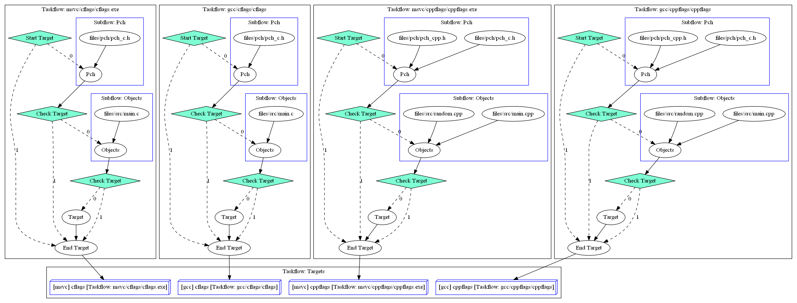

# Build in CPP _[BuildCC]_

Build C, C++ and ASM files in C++

# Aim

**_BuildCC_** aims to be an alternative to **Makefiles** while using the feature rich C++ language instead of a custom DSL. 

## Features

- Complete flexibility for custom workflows and toolchains
- C++ language feature benefits and **debuggable build binaries**
- Optimized rebuilds through serialization. See [target.fbs schema](buildcc/schema/target.fbs)
  - Can optimize for rebuilds by comparing the previous stored build with current build.
  - Also see the [FAQ](#faq) for more details on Serialization
- Customizable for community plugins. More details provided in the [Community Plugin](#community-plugin) section.

## Pre-requisites

- C++17 Compiler with
  - `C++17 filesystem` library support
  - `C++11 thread` library support
- Third Party Libraries (See License below)
  - Flatbuffers v2.0.0
  - Taskflow v3.1.0
  - CLI11 v2.1.0
  - Tiny Process Library v2.0.4
  - fmt v8.0.1
  - spdlog v1.9.2
  - CppUTest v4.0

# General Information

- A one stage `input / output` procedure is called a **Generator** with a wide variety of use cases
  - Single input creates single output
  - Single input creates multiple outputs
  - Multiple inputs create single output
  - Multiple inputs creates multiple outputs
- A two stage `compile` and `link` procedure is called a **Target**
  - This means that Executables, StaticLibraries and DynamicLibraries are all categorized as Targets
  - In the future C++20 modules can also be its own target depending on compiler implementations
- Every Target requires a complementary (and compatible) **Toolchain**
  - This ensures that cross compiling is very easy and explicit in nature.
  - Multiple toolchains can be _mixed_ in a single build file i.e we can generate targets using the GCC, Clang, MSVC and many other compilers **simultaneously**.
- The `compile_command` (pch and object commands) and `link_command` (target command) is fed to the `process` call to invoke the `Toolchain`.
- Each **Target** can depend on other targets efficiently through Parallel Programming using **Taskflow**.
  - Dependency between targets is explicitly mentioned through the Taskflow APIs
  - This has been made easier for the user through the `buildcc::Register` module.
- Build files can be customized through command line arguments
  - Command line arguments can be stored in configurable `.toml` files and passed using the `--config` flag.
  - Users can define their own custom arguments.
  - Argument passing has been made easy using the `buildcc::Args` module.

**Taskflow dependency for hybrid/simple example**

- Build GCC and MSVC Targets simultaneously
- 1 C and 1 CPP example for both toolchains

**Taskflow dependency for hybrid/pch example**

- Activate PCH for GCC and MSVC Targets
- 1 C and 1 CPP example for both toolchains

**Taskflow dependency for hybrid/dep_chaining example**

- Chain **Generator** with **Targets** for Dependency
- 1 C and 1 CPP example for both toolchains

# Software Architecture

### Interface lib dependencies

### Single lib dependencies

- See also [how to generate graphs using CMake](doc/software_architecture/generate_cmake_graphviz.md)

## Dependency Chart

- See also [how to create uml diagrams using VSCode](doc/software_architecture/create_uml_diagrams.md)

## Community Plugin

- `buildcc::base::Generator`, `buildcc::base::TargetInfo` and `buildcc::base::Target` contains public getters that can be used to construct unique community plugins.
- Common tools and plugins would have first-party support in buildcc.
- All other tools and plugins can be maintained by individual developers.

**Current state of BuildCC supported plugins**

- [x] [ClangCompileCommands](buildcc/plugins/include/plugins/clang_compile_commands.h)
- [ ] [BuildCCFind](buildcc/plugins/include/plugins/buildcc_find.h)
  - [x] Host system executable
  - [ ] BuildCC Library
  - [ ] BuildCC Plugin
- [ ] ClangFormat
- [ ] Target graph visualizer (through Taskflow)

# Examples

Contains **proof of concept** and **real world** [examples](example/README.md).

# User Guide

Developers interested in using **_BuildCC_**

- [Installation using CMake](doc/user/installation_using_cmake.md)
- API List

# Developer Guide

Developers interested in contributing to **_BuildCC_**

- [Project internal information](doc/developer/project_internals.md)
- Bootstrapping
- Current code structure
- Guidelines

# FAQ

## Generator

- How do I use the `base::Generator`

## Target

- Brief overview of `base::TargetInfo`
- Brief overview of `base::Target`
- [How do I supply my own custom `compile_command` and `link_command` to targets?](doc/target/custom_commands.md)

## Serialization

- [Understanding `path.fbs`](doc/serialization/path_fbs.md)
- Understanding `generator.fbs`
- Understanding `target.fbs`

## Design/Reasoning

- [Why has _this_ third-party library been chosen?](doc/faq/why_this_lib.md)
- [Why do you track _include directories_ and _header files_?](doc/faq/include_dir_vs_header_files.md)

## Miscellaneous

- [Why `-Wl,--allow-multiple-definition` for MINGW?](doc/faq/mingw_taskflow_linker_option.md)

# TODO

[List of features](TODO.md) to be implemented before buildcc can be considered production ready.

I would also like to request help from the Community for the following:
- Code reviews
- Design patterns
- Optimization strategies
- TODO discussions

# License Dependencies

_BuildCC_ is licensed under the Apache License, Version 2.0. See [LICENSE](LICENSE) for the full license text. _BuildCC_ aims to use open-source libraries containing permissive licenses. 

> Developers who would like to suggest an alternative library, raise an issue with the **license** and **advantages** clearly outlined.

- [Fmtlib](https://github.com/fmtlib/fmt) (Formatting) [MIT License] [Header Only]
- [Spdlog](https://github.com/gabime/spdlog) (Logging) [MIT License] [Header Only]
- [Tiny Process Library](https://gitlab.com/eidheim/tiny-process-library) (Process handling) [MIT License]
- [Taskflow](https://github.com/taskflow/taskflow) (Parallel Programming) [MIT License] [Header Only]
  - See also [3rd-Party](https://github.com/taskflow/taskflow/tree/master/3rd-party) used by Taskflow
- [Flatbuffers](https://github.com/google/flatbuffers) (Serialization) [Apache-2.0 License] [Header Only]
- [CLI11](https://github.com/CLIUtils/CLI11) (Argument Parsing) [BSD-3-Clause License] [Header Only]
- [CppUTest](https://github.com/cpputest/cpputest) (Unit Testing/Mocking) [BSD-3-Clause License]
