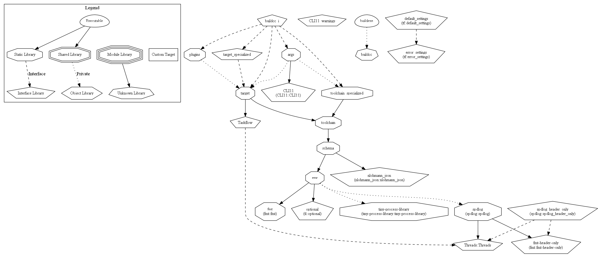

# Build in CPP _[BuildCC]_

[](https://github.com/coder137/build_in_cpp/actions/workflows/linux_gcc_cmake_build.yml)

[](https://github.com/coder137/build_in_cpp/actions/workflows/win_cmake_build.yml)

[](https://codecov.io/gh/coder137/build_in_cpp)

Build C, C++ and ASM files in C++

# Aim

**_BuildCC_** aims to be an alternative to **Makefiles** while using the feature rich C++ language instead of a custom DSL. 

## Features

- Complete flexibility for custom workflows and toolchains
- C++ language feature benefits and **debuggable build binaries**
- Optimized rebuilds through serialization. See [target.fbs schema](buildcc/schema/target.fbs)
  - Can optimize for rebuilds by comparing the previous stored build with current build.
  - See also [FAQ](#faq)
- Customizable for community plugins. More details provided in the `Community Plugin` section.

## Pre-requisites

- C++17 Compiler with
  - `C++17 filesystem` library support
  - `C++11 thread` library support
- Third Party Libraries (See License below)
  - Flatbuffers v2.0.0
  - Taskflow v3.1.0
  - CLI11 v1.9.1
  - Tiny Process Library v2.0.4
  - fmt v8.0.1
  - spdlog v1.9.2
  - CppUTest v4.0

# General Information

- A one stage `input / output` procedure is called a **Generator** with a wide variety of use cases
  - Single input creates single output
  - Single input creates multiple outputs
  - Multiple inputs create single output
  - Multiple inputs creates multiple outputs
- A two stage `compile` and `link` procedure is called a **Target**
  - This means that Executables, StaticLibraries and DynamicLibraries are all categorized as Targets
  - In the future C++20 modules can also be its own target dependending on compiler implementations
  - The two stages are built using **Generators** where link generation depends on compile generation
- Every Target requires a complementary (and compatible) **Toolchain**
  - This ensures that cross compiling is very easy and explicit in nature.
  - Multiple toolchains can be _mixed_ in a single build file i.e we can generate targets using the GCC, Clang, MSVC and many other compilers **simultaneously**.
- The `compile_command` and `link_command` is fed to the `process/system` call to generate files.
- Each **Target** can depend on other targets efficiently through Parallel Programming using **Taskflow**.
  - Dependency between targets is explicitly mentioned through the Taskflow APIs
  - This has been made easier for the user through the `buildcc::Register` module.
- Build files can be customized through command line arguments
  - Command line arguments can be stored in configurable `.toml` files and passed using the `--config` flag.
  - Users can define their own custom arguments.
  - Argument passing has been made easy using the `buildcc::Args` module.

**Taskflow dependency for hybrid/simple example**

See also [Software Architecture](#software-architecture)


## Software Architecture

### Interface lib dependencies



### Single lib dependencies


- See also [how to generate graphs using CMake](doc/software_architecture/generate_cmake_graphviz.md)

## Community Plugin

- [x] [ClangCompileCommands](buildcc/plugins/include/plugins/clang_compile_commands.h)
- [ ] ClangFormat
- [ ] Target graph visualizer (through Taskflow)

- `buildcc::base::Target` contains public getters that can be used to construct unique community plugins.
- Common tools and plugins would have first-party support in buildcc.
- All other tools and plugins can be maintained through individual developers.

# User Guide

Developers interested in using **_BuildCC_**

## BuildCC User options

- BUILDCC_INSTALL: ON
- BUILDCC_FLATBUFFERS_FLATC: ON
- BUILDCC_BUILD_AS_SINGLE_LIB: ON
  - Generates `libbuildcc`
- BUILDCC_BUILD_AS_INTERFACE_LIB: OFF
  - Generates `libbuildcc_i` with other `lib`s linked during compilation 
- BUILDCC_PRECOMPILE_HEADERS: OFF
- BUILDCC_EXAMPLES: OFF
  - Uses SINGLE_LIB for its examples
- BUILDCC_TESTING: ON
  - Unit testing with `ctest --output-on-failure`
  - Only active for GCC compilers
  - Provides code coverage
  - `cmake --build {builddir} --target lcov_coverage` (on linux ONLY)
  - `cmake --build {builddir} --target gcovr_coverage` (installed via pip gcovr)
- BUILDCC_CLANGTIDY: ON
  - Auto runs with CMake
- BUILDCC_CPPCHECK: ON
  - Cppcheck with `cmake --build {builddir} --target cppcheck_static_analysis`
- BUILDCC_DOCUMENTATION: ON
  - Basic Doxygen generated html pages
  - `cmake --build {builddir} --target doxygen_documentation`
- BUILDCC_NO_DEPRECATED: OFF
  - Required on certain clang arch compilers `-Wno-deprecated` flag

## Build

> NOTE: Currently, BuildCC needs to be built from source and bootstrapped using CMake.

> I aim to bootstrap BuildCC into an executable to remove the dependency on CMake.

- By default all the developer options are turned OFF.
- Only the `BUILDCC_INSTALL` option is turned on.

```bash
# Generate your project
cmake -B [Build folder] -G [Generator]
cmake -B build -G Ninja

# Build your project
cmake --build build
```

## Install

```bash
# Manually
cd [build_folder]
sudo cmake --install .

# Cpack generators
cpack --help

# ZIP
cpack -G ZIP

# Executable
cpack -G NSIS
```

> NOTE: On windows [NSIS](https://nsis.sourceforge.io/Main_Page) needs to be installed

- Install the package and add to environment PATH
- As a starting point, go through the **gcc/AfterInstall** example and **Hybrid** examples
- For more details read the `examples` README to use buildcc in different situations

## Examples

Contains **proof of concept** and **real world** [examples](example/README.md).

# Developer

Developers interested in contributing to **_BuildCC_**

## Build

### CMakePresets (from Version 3.20)

- See `CMakePresets.json` for GCC, MSVC and Clang configurations
```bash
# Generating
cmake --list-presets
cmake --preset=[your_preset]

# Building
cmake --build --list-presets
cmake --build --preset=[your_preset]

# Testing (ONLY supported on gcc)
ctest --preset=gcc_dev_all
```

### Custom Targets

```bash
# Run custom target using
cd [folder]
cmake --build . --target [custom_target]
```

**Tools**
- cppcheck_static_analysis
- doxygen_documentation
- gcovr_coverage
- lcov_coverage

**Examples**
- run_hybrid_simple_example_linux
- run_hybrid_simple_example_win
- run_hybrid_foolib_example_linux
- run_hybrid_foolib_example_win
- run_hybrid_externallib_example_linux
- run_hybrid_externallib_example_win
- run_hybrid_customtarget_example_linux
- run_hybrid_customtarget_example_win

## Install

- See the **user installation** section above

- Read [Install target](buildcc/lib/target/cmake/target_install.cmake)

Basic Installation steps
- Install `TARGETS`
- Install `HEADER FILES`
- Export `CONFIG`

## Test

- Read [Mock env](buildcc/lib/env/CMakeLists.txt)
- Read [Mock target](buildcc/lib/target/cmake/mock_target.cmake)
- Read [Test path](buildcc/lib/target/test/path/CMakeLists.txt)
- Read [Test target](buildcc/lib/target/test/target/CMakeLists.txt)

# FAQ

- [Why has _this_ third-party library been chosen?](doc/faq/why_this_lib.md)
- [How do I create my own custom target commands?](doc/custom_target/commands.md)

## Design

- [Why do you track _include directories_ and _header files_?](doc/faq/include_dir_vs_header_files.md)

## Miscellaneous

- [Why `-Wl,--allow-multiple-definition` for MINGW?](doc/faq/mingw_taskflow_linker_option.md)

# TODO

[List of features](TODO.md) to be implemented before buildcc can be considered production ready.

I would also like to request help from the Community for the following:
- Code reviews
- Design patterns
- Optimization strategies
- TODO discussions

# License Dependencies

_BuildCC_ is licensed under the Apache License, Version 2.0. See [LICENSE](LICENSE) for the full license text. _BuildCC_ aims to use open-source libraries containing permissive licenses. 

> Developers who would like to suggest an alternative library, raise an issue with the **license** and **advantages** clearly outlined.

- [Fmtlib](https://github.com/fmtlib/fmt) (Formatting) [MIT License] [Header Only]
- [Spdlog](https://github.com/gabime/spdlog) (Logging) [MIT License] [Header Only]
- [Tiny Process Library](https://gitlab.com/eidheim/tiny-process-library) (Process handling) [MIT License]
- [Taskflow](https://github.com/taskflow/taskflow) (Parallel Programming) [MIT License] [Header Only]
  - See also [3rd-Party](https://github.com/taskflow/taskflow/tree/master/3rd-party) used by Taskflow
- [Flatbuffers](https://github.com/google/flatbuffers) (Serialization) [Apache-2.0 License] [Header Only]
- [CLI11](https://github.com/CLIUtils/CLI11) (Argument Parsing) [BSD-3-Clause License] [Header Only]
- [CppUTest](https://github.com/cpputest/cpputest) (Unit Testing/Mocking) [BSD-3-Clause License]
