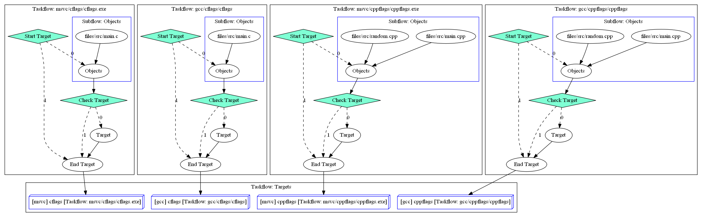

# Build in CPP _[BuildCC]_

Build C, C++ and ASM files in C++

# Aim

# General

- A `compile` and `link` procedure is called a **Target**
  - This means that Executables, StaticLibraries and DynamicLibraries are all categorized as Targets
  - In the future C++20 modules can also be its own target dependending on compiler implementations
- Every Target requires a complementary (and compatible) **Toolchain**
  - This ensures that cross compiling is very easy and explicit in nature.
  - Multiple toolchains can be _mixed_ in a single build file i.e we can generate targets using the GCC, Clang, MSVC and many other compilers **simultaneously**.
- The `compile_command` and `link_command` is fed to the `process/system` call to generate files.
- Each **Target** can depend on other targets efficiently through Parallel Programming using **Taskflow**.
  - Dependency between targets is explicitly mentioned through the Taskflow APIs
  - This has been made easier for the user through the `buildcc::Register` module.
- Build files can be customized through command line arguments
  - Command line arguments can be stored in configurable `.toml` files and passed using the `--config` flag.
  - Users can define their own custom arguments.
  - Argument passing has been made easy using the `buildcc::Args` module.

**Taskflow dependency for hybrid/simple example**

See also [Software Architecture](#software-architecture)

## Features

- Complete flexibility for custom / brand new toolchains
- C++ language feature benefits and **debuggable build binaries**
- Optimized rebuilds through serialization. See [target.fbs schema](buildcc/lib/target/fbs/target.fbs)
  - Can optimize for rebuilds by comparing the previous stored build with current build.
- Customizable for community plugins. More details provided in the `Community Plugin` section.

## Software Architecture


- See also [how to generate graphs using CMake](doc/software_architecture/generate_cmake_graphviz.md)

## Community Plugin

# User Guide

Developers interested in using **_BuildCC_**

## Build

> NOTE: Currently, BuildCC needs to be built from source and bootstrapped using CMake.

> I aim to bootstrap BuildCC into an executable to remove the dependency on CMake.

- By default all the developer options are turned OFF.
- Only the `BUILDCC_INSTALL` option is turned on.

```bash
# Generate your project
cmake -B [Build folder] -G [Generator]
cmake -B build -G Ninja

# Build your project
cmake --build build
```

## Install

```bash
# Generators
cpack --help

# ZIP
cpack -G ZIP

# Executable
cpack -G NSIS
```
- Install the package and add to environment PATH
- See the `gcc/AfterInstall` example find packages and link with buildcc
- Check the `examples` section below to use buildcc in different situations

## Examples

Contains **proof of concept** and **real world** [examples](example/README.md).

# Developer

Developers interested in contributing to **_BuildCC_**

## Build

### CMakePresets (from Version 3.20)

- See `CMakePresets.json` for GCC, MSVC and Clang configurations
```bash
# Generating
cmake --list-presets
cmake --preset=[your_preset]

# Building
cmake --build --list-presets
cmake --build --preset=[your_preset]

# Testing (ONLY supported on gcc)
ctest --preset=gcc_dev_all
```

### Custom Targets

```bash
# Run custom target using
cd [folder]
cmake --build . --target [custom_target]
```

**Tools**
- cppcheck_static_analysis
- doxygen_documentation
- gcovr_coverage
- lcov_coverage

**Examples**
- run_hybrid_simple_example_linux
- run_hybrid_simple_example_win
- run_hybrid_foolib_example_linux
- run_hybrid_foolib_example_win
- run_hybrid_externallib_example_linux
- run_hybrid_externallib_example_win
- run_hybrid_customtarget_example_linux
- run_hybrid_customtarget_example_win


## Install

- Uses CPack to generate ZIP or executable files
```bash
# See all generators
cpack --help

# Using a generator
cd [build folder]

# Generate ZIP
cpack -G ZIP

# Generate executable
cpack -G NSIS
```

> NOTE: On windows [NSIS](https://nsis.sourceforge.io/Main_Page) needs to be installed

> TODO, Detailed explanation of how installation has been setup

## Test

> TODO, Detailed explanation of how tests have been setup

# FAQ

# TODO

[List of features](TODO.md) to be implemented before buildcc can be considered production ready.

# License Dependencies

_BuildCC_ is licensed under the Apache License, Version 2.0. See [LICENSE](LICENSE) for the full license text. _BuildCC_ aims to use open-source libraries containing permissive licenses. 

> Users who would like to suggest an alternative library, raise an issue with the **license** and **advantages** clearly outlined.

- [Fmtlib](https://github.com/fmtlib/fmt) (Formatting) [MIT License]
- [Spdlog](https://github.com/gabime/spdlog) (Logging) [MIT License]
- [Taskflow](https://github.com/taskflow/taskflow) (Parallel Programming) [MIT License]
  - See also [3rd-Party](https://github.com/taskflow/taskflow/tree/master/3rd-party) used by Taskflow
- [Flatbuffers](https://github.com/google/flatbuffers) (Serialization) [Apache-2.0 License]
- [CLI11](https://github.com/CLIUtils/CLI11) (Argument Parsing) [BSD-3-Clause License]
- [CppUTest](https://github.com/cpputest/cpputest) (Unit Testing/Mocking) [BSD-3-Clause License]
